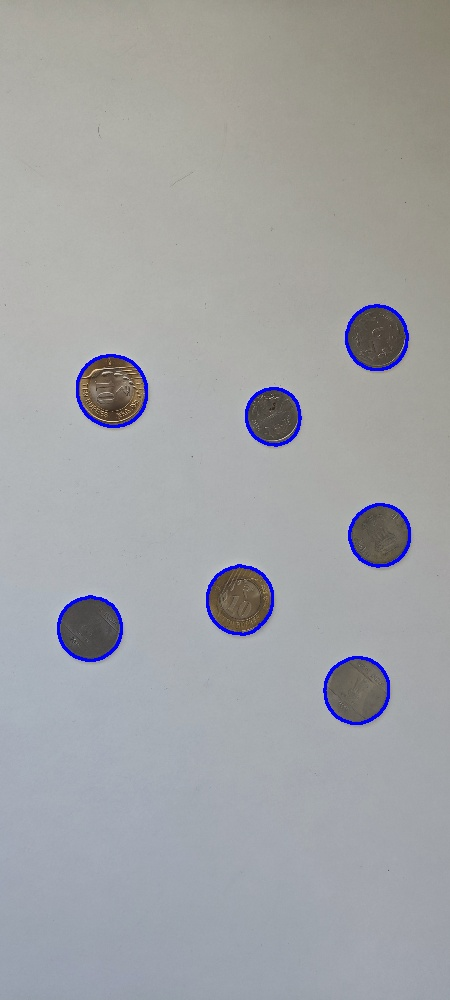
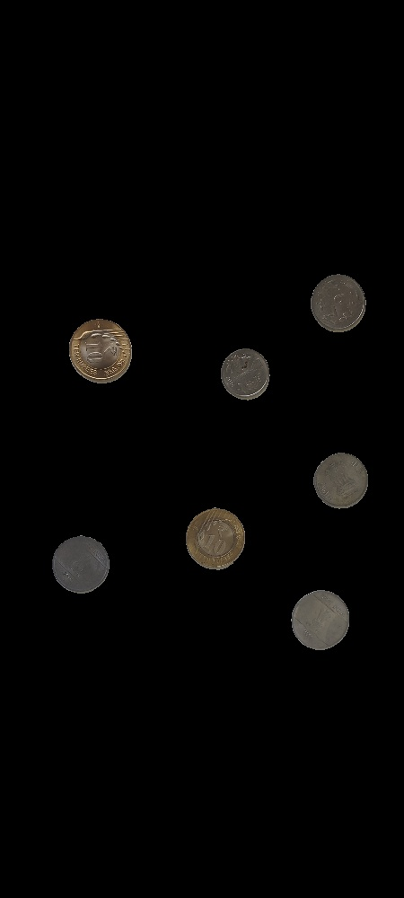
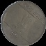
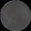
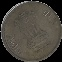
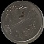
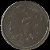
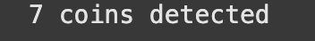
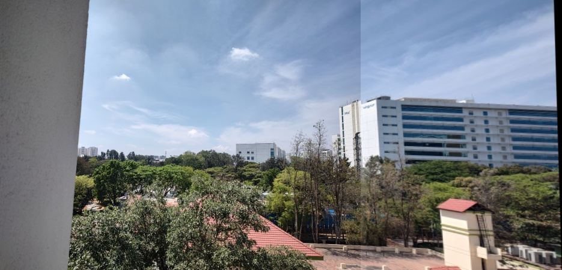

# Assignment-1 


## Repository Structure

```
📦 Assignment Repo  
│-- 📜 README.md  
│  
├── 📂 Q1  
│   ├── 📂 data  
│   │   ├── 1.png  
│   │   ├── 2.png  
│   │   ├── 3.png  
│   │   ├── 4.png  
│   |   ├── 📂 2_output  
│   │       
│   ├── Q1.ipynb  
│   ├── Q1.py  
│  
├── 📂 Q2  
│   ├── 📂 data  
│   │   ├── 📂 example_1  
│   │   │   ├── 1.png  
│   │   │   ├── 2.png  
│   │   │   ├── ...  
│   │   │  
│   │   ├── 📂 example_2  
│   │   │   ├── 1.png  
│   │   │   ├── 2.png  
│   │   │   ├── ...  
│   │   ├── 📂 example_1_output  
│   │        ├── panorama.png  
│   │     
│   │  
│   ├── Q2.ipynb  
│   ├── Q2.py  
```

This repository contains solutions for two questions (Q1 and Q2) of the assignment.
-	Q1 Folder
	-	data/: Contains four images of coins (1.png, 2.png, etc.).
	-	2_output/: Stores the processed outputs for 2.png.
	-	Q1.ipynb and q1.py: Contains the implementation of the solution for Q1.
 
-	Q2 Folder
 	-	data/: Includes two example folders (example_1 and example_2) containing images for processing.
	-	example_1_output/: Stores the processed output images for the first example set.
	-	Q2.ipynb and q2.py: Contains the implementation of the solution for Q2.

Each .ipynb file contains a Jupyter Notebook version of the solution, while the .py script provides the corresponding Python implementation.

# PART-A
# Coin Detection, Segmentation, and Counting

## Overview
This part uses computer vision techniques to detect, segment, and count coins from an image containing scattered Indian coins. The implementation is done in a Jupyter Notebook (`.ipynb`).

## Requirements
To run the notebook, ensure you have Python installed (preferably Python 3.7 or later).
and install the required dependencies using:
```bash
pip install opencv-python numpy 
```

## Steps to Run

- There are both jupter notebook (prefered) and normal python file for the same code available
- Clone the repo and follow the given steps
- Follow the given input and output directory structures 

Running the Python Script (Q1.py)
1.	Open a terminal or command prompt.
2.	Navigate to the Q1 folder:
```
cd Q1
```

3.	Install the required dependencies:
```
pip install opencv-python numpy argparse
```

4.	Run the script:
```
python Q1.py
```


Running the Jupyter Notebook (Q1.ipynb)
1.	Install Jupyter Notebook if not already installed:
```
pip install jupyter
```

2.	Navigate to the Q1 folder:

```
cd Q1
```

3.	Launch Jupyter Notebook or Open in Google Colab/ Vs code :

```
jupyter notebook
```
Run the cells in sequential order 

## Steps

###  1. User Input
- The script first asks user for input image path  and output directory to save the processed images:

### 2. Preprocessing the Image
- Convert the image to grayscale.
- Resize while maintaining aspect ratio (max_dim == 1000).
- Apply Gaussian blur (7x7).
- Uses adaptive thresholding for better edge detection.

### 3. Coin Detection
- Find contours in the thresholded image.
- Filter out circular objects based on perimeter and area.
- Visualize detected coins by outlining them in blue.

### 4. Coin Segmentation
- Create a binary mask based on detected contours.
- Extract segmented coin images on a black background.
- Save the segmented image.

### 5. Individual Coin Extraction
- Extract each detected coin using minimum enclosing circles.
- Crop and save each coin separately.

### 6. Coin Counting
- Counts the total number of detected coins.
- Displays the count as an console output.

## Running the Notebook
1. Open the Jupyter Notebook (`.ipynb` file) in Google Colab or JupyterLab.
2. Upload an image containing scattered Indian coins.
3. Run the cells sequentially to process the image and obtain results.

## Expected Outputs
- `edges_detected.jpg`: Image with detected coin contours outlined.
- `segments.jpg`: Image with segmented coins on a black background.
- `coin_X.jpg`: Individual extracted coins.
- Console Output: Total number of detected coins.


## Sample Input 

### 1. Original Image (Sample Input)


This is the original image that will be processed.


---

## Sample Output

### 1. Edge Detection (Expected Output)



Edges of objects in the image are detected using Canny edge detection.

### 2. Image Segmentation (Expected Output)



The image is segmented based on intensity values.

### 2. Individual Coins Cropped   (Expected Output)













The individual images for each coins detected

### 4. Number of coins (Expected Console Output)

```
7 coins detected
```


Ensure that all input images are placed in the correct directory before running the notebook.


# PART-B
# Image Stitching using OpenCV

## Overview
This part performs image stitching using SIFT feature detection and homography transformation to align and merge images into a panoramic view. It reads a sequence of images, detects keypoints, matches them, computes a homography matrix, and stitches images together.


## Requirements

To run the notebook, install the required dependencies using:
```bash

pip install numpy opencv-python imutils tqdm argparse
```

## Steps to Run

- There are both jupter notebook (prefered) and normal python file for the same code available
- Clone the repo and follow the given steps
- Follow the given input and output directory structures 

Running the Python Script (Q2.py)
1.	Open a terminal or command prompt.
2.	Navigate to the Q1 folder:
```
cd Q2
```

3.	Install the required dependencies:
```
pip install opencv-python numpy argparse
```

4.	Run the script:
```
python Q2.py
```


Running the Jupyter Notebook (Q2.ipynb)
1.	Install Jupyter Notebook if not already installed:
```
pip install jupyter
```

2.	Navigate to the Q2 folder:

```
cd Q2
```

3.	Launch Jupyter Notebook or Open in Google Colab/ Vs code :


```
jupyter notebook
```
Run the cells in sequential order.


## Steps

###  1. User Input
- The script first asks user for input and output directories path
- The input directory must contain images named in sequential numerical order, such as 1.png, 2.png, …, N.png. The output directory will store the generated panorama image, which will be saved as panorama.jpg.

###  2. Read & Sort Images
- The script reads images from the input directory.
- It filters out non-numeric filenames and sorts them in numerical order.

###  3. Load the First Image
- Reads and resizes the first image to 600px width for consistency.


###  4. Detect Keypoints & Descriptors using SIFT
- Uses the SIFT algorithm to extract feature points from each image by looping over the input images.


### 5. Match Keypoints using KNN & Apply Ratio Test
- Using K-Nearest Neighbors (KNN) to match features between consecutive images.
- Applies Lowe’s ratio test (0.75 threshold) to filter good matches.


### 6. Compute Homography & Warp Image
- Homography matrix aligns one image onto the next.
- Uses cv2.RANSAC with a threshold of 5.0 for  transformation.


### 7. Blend & Stitch Images
- The right image is blended onto the warped perspective of the left image.
- Crops excess black areas using contours & bounding box extraction.

### 8. Repeat
- The combined images becomes the left image now and the next image will be merged repating the above steps

---

##  Expected Output

- panorama.jpg ( Final Panorama Image)

---

## Sample Input

Sample directory structure:

```
input_dir/
 ├── 1.jpg
 ├── 2.jpg
 ├── 3.jpg
```
### 1. Sample Input Images


---

##  Sample Output

Final stitched panorama saved in:

```
output_dir/
 ├── panorama.jpg
```

### 1. Sample Output Image


